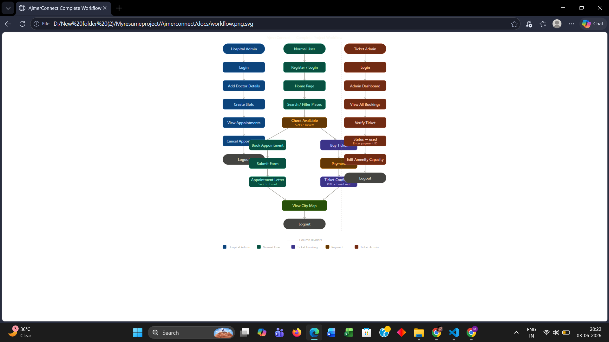

# AjmerConnect — City Guide Platform 🏙️

A comprehensive Django-based city guide web application for **Ajmer, Rajasthan, India**.  
This platform connects citizens and visitors with essential services, amenities, and healthcare facilities.

---

## 🌐 Live Project
> Run locally at: `http://127.0.0.1:8000`

---


---

## ✨ Features

### 🏥 Hospital Management
- View all hospitals in Ajmer with details
- Browse doctors by specialization
- Book doctor appointments with available slots
- Slot capacity management (max patients per slot)
- Appointment status tracking — pending, confirmed, cancelled
- Hospital admin dashboard to manage doctors and appointments

### 🎫 Ticket Booking System
- Book tickets for amenities (museums, forts, parks)
- Real-time availability checking
- Auto-calculated total amount
- Booking status — pending → confirmed → used
- PDF ticket generated automatically
- Email sent with PDF attachment after payment

### 💳 Payment System
- Mock Razorpay payment integration
- Payment status tracking
- Secure payment flow with booking confirmation

### 🗺️ Interactive City Map
- Leaflet.js powered interactive map (no API key required)
- All hospitals and amenities shown as markers
- Search and filter places on map
- Get directions to any location
- Custom icons for different place types

### 👤 User Authentication
- Custom user model with role-based access
- 4 user roles: super_admin, hospital_admin, ticket_admin, user
- Email-based password reset with UUID (10 min expiry)
- Email verification system

### 🔐 Admin Panels
- **Hospital Admin** → Manage doctors, slots, appointments
- **Ticket Admin** → Verify tickets, view bookings, edit capacity
- **Super Admin** → Django admin panel

---

## 🛠️ Technology Stack

| Technology | Purpose |
|---|---|
| Python 3.12 | Programming Language |
| Django 5.1 | Web Framework |
| MySQL | Database |
| Bootstrap 5 | Frontend CSS Framework |
| JavaScript | Frontend Interactivity |
| Leaflet.js | Interactive Map |
| Gmail SMTP | Email Sending |
| Mock Razorpay | Payment Gateway |
| xhtml2pdf | PDF Generation |
| python-dotenv | Environment Variables |

---

## 📁 Project Structure

```
Ajmerconnect/
├── Ajmerconnect/          # Main project settings
│   ├── settings.py
│   ├── urls.py
│   └── wsgi.py
├── core/                  # User auth, home, map
│   ├── models.py          # CustomUser model
│   ├── views.py           # Login, register, home, map
│   └── urls.py
├── hospital/              # Hospital management
│   ├── models.py          # Hospital, Doctor, Slot, Appointment
│   ├── views.py
│   └── urls.py
├── amenity/               # City amenities
│   ├── models.py          # Amenity model
│   ├── views.py
│   └── urls.py
├── booking/               # Ticket booking
│   ├── models.py          # Booking model
│   ├── views.py
│   └── urls.py
├── payment/               # Payment processing
│   ├── models.py          # Payment model
│   ├── views.py
│   └── urls.py
├── templates/             # HTML templates
│   ├── core/
│   ├── hospital/
│   ├── amenity/
│   ├── booking/
│   └── payment/
├── static/                # CSS, JS, Images
├── media/                 # User uploaded files
├── requirements.txt
└── .env                   # Environment variables (not on GitHub)
```

---

## 🚀 Getting Started

### Prerequisites
- Python 3.12+
- MySQL
- pip

### Installation

1. **Clone the repository**
   ```bash
   git clone https://github.com/yourusername/AjmerConnect.git
   cd AjmerConnect
   ```

2. **Install dependencies**
   ```bash
   pip install -r requirements.txt
   ```

3. **Create `.env` file** in root directory
   ```
   SECRET_KEY=your-secret-key
   DEBUG=True
   DB_NAME=your_db_name
   DB_USER=your_db_user
   DB_PASSWORD=your_db_password
   DB_HOST=localhost
   DB_PORT=3306
   EMAIL_HOST_USER=your-email@gmail.com
   EMAIL_HOST_PASSWORD=your-app-password
   ```

4. **Run migrations**
   ```bash
   python manage.py migrate
   ```

5. **Create superuser**
   ```bash
   python manage.py createsuperuser
   ```

6. **Run the server**
   ```bash
   python manage.py runserver
   ```

7. **Visit the application**
   - Home: `http://localhost:8000/`
   - Admin: `http://localhost:8000/admin/`

---

## 📌 Key Pages

| Page | URL | Description |
|---|---|---|
| Home | `/` | Featured amenities + map |
| Hospitals | `/hospital/hospitals/` | All hospitals list |
| Amenities | `/amenity/` | All amenities list |
| City Map | `/map/` | Interactive Leaflet map |
| Book Ticket | `/booking/create/<id>/` | Ticket booking |
| Payment | `/payment/pay/<id>/` | Payment page |
| Admin Dashboard | `/booking/admin/` | Ticket admin |
| Amenity Admin | `/amenity/admin/` | Amenity management |

---

## 👥 User Roles

| Role | Access |
|---|---|
| `super_admin` | Full Django admin access |
| `hospital_admin` | Hospital dashboard — doctors, slots, appointments |
| `ticket_admin` | Booking dashboard — verify tickets, manage bookings |
| `user` | Browse, book appointments, buy tickets |

---

## 🔒 Security Features
- CSRF protection on all forms
- Password hashing (Django built-in)
- Login required decorators on protected views
- Environment variables for sensitive data
- UUID-based password reset with expiry

---

## 🙏 Built With ❤️ for the City of Ajmer

> **Note**: Add your actual email and contact details before deploying to production.


## 📸 Project Workflow

